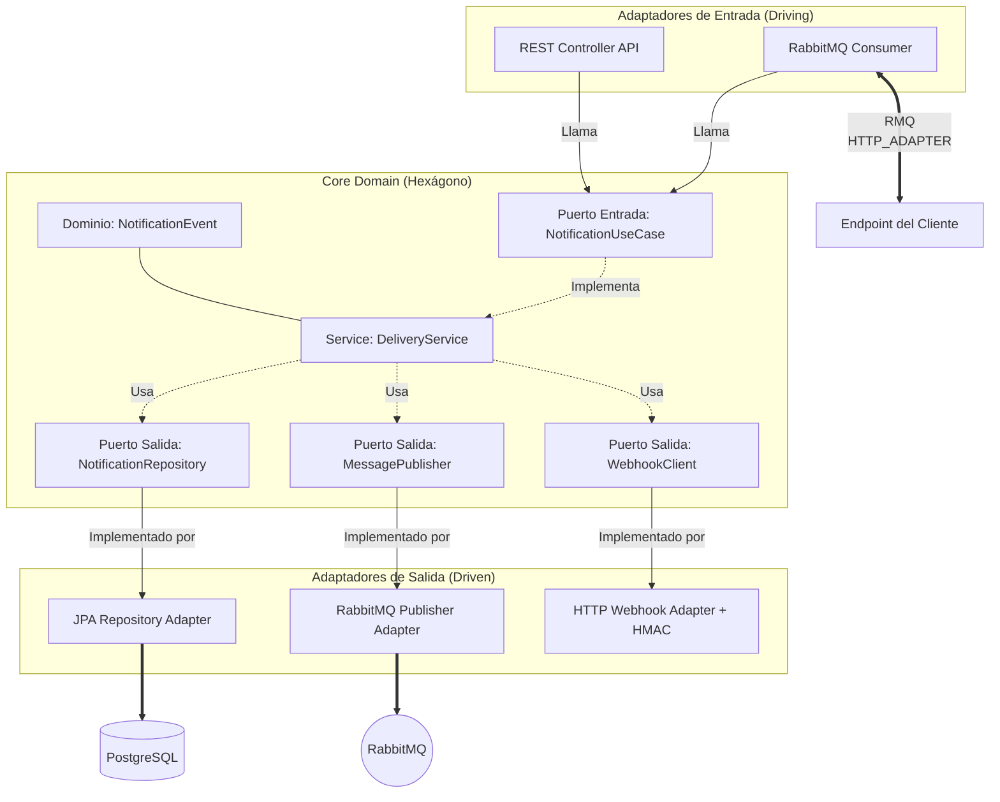

# Documento de Diseño Arquitectónico

## 1. Arquitectura de Software
Este proyecto emplea la **Arquitectura Hexagonal (Puertos y Adaptadores)**. Su principal objetivo es lograr que la aplicación central y su dominio sean totalmente independientes de los detalles de infraestructura externa (Bases de datos, UI, sistemas de mensajería, APIs de terceros).

### Diagrama de la Arquitectura

## 2. Decisión de Componentes

| Componente | Elección | Justificación |
| :--- | :--- | :--- |
| **Lenguaje** | Java 21 | Soporte LTS, Tipado Fuerte, Rendimiento, y **Virtual Threads** (Loom) ideales para aplicaciones que hacen muchas llamadas I/O (Webhooks) sin agotar hilos del SO. |
| **Framework** | Spring Boot 3.3 | Estándar de la industria, ecosistema rico (Data JPA, AMQP, Web). Acelera el desarrollo y garantiza robustez. |
| **Base de Datos** | PostgreSQL 16 | ACID compliant, escalable, ideal para persistir de forma segura el historial y los estados de las notificaciones (`PENDING`, `COMPLETED`, `FAILED`). |
| **Mensajería** | RabbitMQ | Desacopla la API del proceso pesado de envío HTTP. Soporta rutinas complejas como colas de retraso (Exponential Backoff) y Dead Letter Queues (DLQ). |
| **Proxy / API Gateway** | NGINX | Centraliza el acceso en el puerto 80, permite aplicar fácilmente Rate Limiting y SSL en el futuro. |

## 3. Estrategia de Resiliencia y Fallos

Cuando un Webhook falla por problemas de red o porque el cliente responde con un error HTTP 5xx:
1. **Exponential Backoff:** El sistema no reintenta de inmediato. Utiliza un retraso exponencial (ej. 2s, 4s, 8s...) y añade *Jitter* (aleatoriedad) para evitar problemas de "Thundering Herd".
2. **Dead Letter Queue (DLQ):** Tras llegar al máximo configurado de intentos (5), el mensaje no se descarta. Se enruta a una DLX (Dead Letter Exchange) para que sea guardado y auditado posteriormente.

## 4. Seguridad de la Información
1. **Confianza y Autenticidad:** Todo Webhook emitido por nuestro sistema incluye el header `X-Cobre-Signature`. Este es un Hash HMAC-SHA256 generado usando el payload de la solicitud y un secreto compartido con el cliente. Permite garantizar que los datos no fueron manipulados en tránsito.
2. **Autenticación Multi-tenant:** La API de autoservicio valida un JWT (o su fallback simulado en el header `X-Client-Id` para desarrollo local), asegurando que un cliente solo pueda leer o reintentar **sus propias notificaciones**.
3. **Manejo de Errores Global (No Leaks):** Un `@RestControllerAdvice` intercepta errores internos y escupe respuestas controladas (400, 404, 403, 500) en formato JSON, evitando filtrar detalles técnicos sensibles (Stacktraces).

## 5. Análisis de Vulnerabilidades (OWASP Top 10)

Al estar expuesta a Internet, la API fue diseñada contemplando mitigar activamente riesgos descritos en el **OWASP Top 10**:

### 1. Broken Access Control (A01:2021)
* **Riesgo:** Un atacante autenticado o anónimo intenta acceder a notificaciones o disparar eventos (BOLA / IDOR) correspondientes a otros clientes alterando el parámetro `{notification_event_id}`.
* **Mitigación Implementada:** La API valida no solo que el usuario esté autenticado (mediante JWT o el header `X-Client-Id`), sino que en la base de datos se realiza un *query condicional restrictivo* (`findByEventIdAndClientId(eventId, clientId)`). Si el evento existe pero pertenece a otra persona, la API arroja un error transparente `404 Not Found` (o `403 Forbidden`) para no revelar la existencia del registro.

### 2. Security Misconfiguration (A05:2021)
* **Riesgo:** Una excepción de NullPointer o error de conexión a la base de datos se filtra directamente al cliente HTTP, revelando el "stacktrace" de Java, nombres de tablas, versiones del servidor y librerías en uso.
* **Mitigación Implementada:** Se programó un `@RestControllerAdvice` (Manejador Global de Excepciones) que intercepta de forma silenciosa todas las excepciones de tipo `RuntimeException` y las serializa en un JSON de error estándar genérico (HTTP 500), bloqueando fugas de información. Además, la imagen Docker (Alpine Linux) se ejecuta usando buenas prácticas sin escalar a permisos `root`.

### 3. Cryptographic Failures / Data Integrity (A02:2021 / A08:2021)
* **Riesgo:** Un atacante intercepta los webhooks enviados a los clientes (Man in the Middle) y altera el JSON, o inyecta peticiones falsas al servidor del cliente haciéndose pasar por nuestra plataforma (Spoofing).
* **Mitigación Implementada:** Además de enforzar uso de HTTPS en los clientes, se desarrolló el servicio `HmacSigner`. Todas las peticiones de Webhook se cifran utilizando **HMAC-SHA256** (un secreto compartido + el cuerpo del mensaje) y se envían en el header `X-Cobre-Signature`. De esta manera, el cliente receptor recalcula el hash y, si no coincide, rechaza el paquete instantáneamente.
